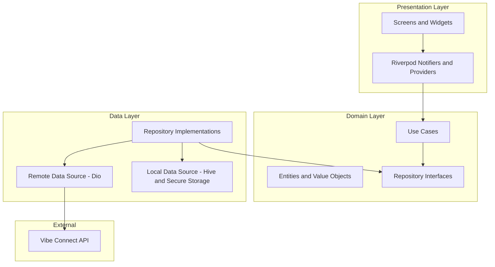
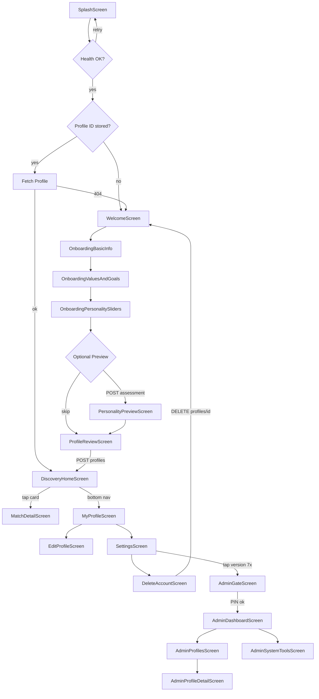
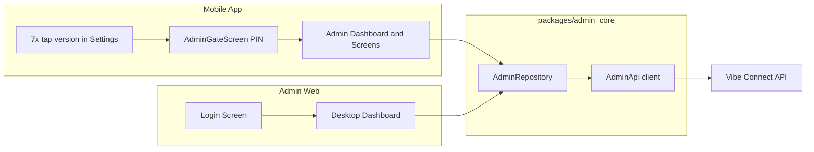

# Vibe Connect — Production Flutter Application Plan

## Context from API Guide

**Base URL:** `https://vibe-connect-si0i.onrender.com`

| Method | Path | Purpose |
|--------|------|---------|
| GET | `/health` | Server + DB health |
| POST | `/api/profiles` | Create/update profile (`name` required; include `id` to update) |
| GET | `/api/profiles` | List all profiles |
| GET | `/api/profiles/{id}` | Get one profile |
| DELETE | `/api/profiles/{id}` | Delete profile |
| GET | `/api/profiles/{id}/matches?top_k=N` | Ranked matches |
| GET | `/api/profiles/{id}/compare/{candidate_id}` | Full compatibility breakdown |
| POST | `/api/assessment` | Big Five snapshot (no DB write) |
| POST | `/api/admin/demo-profiles` | Seed 6 demo profiles (dev only) |
| POST | `/api/admin/reset` | Wipe all profiles (dev only) |

**Critical constraints today:**
- No authentication — anyone with the URL can call every endpoint
- Render free-tier cold starts: first request after ~15 min idle can take **30–50s**
- Errors: `{"error": "message"}` with HTTP 400/404/500
- Admin endpoints exist — exposed only via **hidden in-app admin panel** (PIN-gated) and **admin web**; never in normal user navigation

**Gap note:** The API does not yet expose analytics, moderation queues, profile approval workflows, or audit logs. The admin plan below defines **required backend extensions** alongside what works today.

---

## Recommended Tech Stack

| Layer | Choice | Rationale |
|-------|--------|-----------|
| Language | Dart 3.12+ (existing [`pubspec.yaml`](d:\vibe_connect\pubspec.yaml)) | Matches scaffold |
| State management | **Riverpod 2 + riverpod_annotation** | Testable, compile-safe, scales across features |
| Navigation | **go_router** | Deep links, auth redirects, shell routes |
| HTTP | **dio** + interceptors | Retries, timeouts, auth header injection |
| Models | **freezed + json_serializable** | Immutable DTOs matching API |
| Local storage | **flutter_secure_storage** (profile ID) + **hive** (cache) | Secure ID persistence + fast offline reads |
| Images/UI | Material 3 + custom design tokens | Modern, accessible baseline |
| Animations | **flutter_animate** + implicit animations | Premium feel without heavy custom painters |
| Forms | **flutter_form_builder** or custom validators | Onboarding multi-step validation |
| Logging | **logger** + **firebase_crashlytics** (prod) | Debug vs production observability |
| Testing | **flutter_test**, **mocktail**, **integration_test** | Unit/widget/integration pyramid |
| CI/CD | GitHub Actions + Fastlane | Automated test/build/release |

**Primary targets:** iOS + Android (consumer app). Admin: **dual access** — (1) separate Flutter Web project `admin_web/` for desktop ops, and (2) **hidden admin panel inside the mobile app** unlocked via secret gesture + admin PIN.

---

## Architecture



**Principles:**
- Feature-first folders with shared `core/` and `shared/`
- Unidirectional data flow: UI → Notifier → UseCase → Repository → API
- DTOs at the data boundary; domain entities inside features
- All API calls go through a single `ApiClient` with shared error mapping

---

## Folder Structure (Consumer App)

Replace the default counter in [`lib/main.dart`](d:\vibe_connect\lib\main.dart) with:

```
lib/
├── main.dart
├── app.dart                          # MaterialApp.router, theme, ProviderScope
├── bootstrap.dart                    # init: Hive, env, crash reporting
├── core/
│   ├── config/
│   │   ├── env.dart                  # dev/staging/prod base URLs
│   │   └── app_constants.dart
│   ├── network/
│   │   ├── api_client.dart
│   │   ├── api_endpoints.dart
│   │   ├── interceptors/             # auth, retry, logging
│   │   └── api_exception.dart
│   ├── storage/
│   │   ├── secure_storage_service.dart
│   │   └── cache_service.dart
│   ├── routing/
│   │   ├── app_router.dart
│   │   └── route_names.dart
│   ├── theme/
│   │   ├── app_theme.dart
│   │   ├── app_colors.dart
│   │   ├── app_typography.dart
│   │   └── app_spacing.dart
│   └── utils/
│       ├── result.dart               # sealed Success/Failure
│       └── debouncer.dart
├── shared/
│   ├── widgets/                      # reusable UI (see Design System)
│   └── extensions/
└── features/
    ├── splash/
    ├── onboarding/
    │   ├── data/
    │   ├── domain/
    │   └── presentation/
    ├── personality/
    ├── profile/
    ├── discovery/
    ├── match_detail/
    ├── settings/
    ├── account/
    └── admin/                        # Hidden admin panel (not in bottom nav)
        ├── data/
        │   └── admin_repository.dart
        ├── domain/
        └── presentation/
            ├── admin_gate_screen.dart    # PIN entry after secret unlock
            ├── admin_dashboard_screen.dart
            ├── admin_profiles_screen.dart
            ├── admin_profile_detail_screen.dart
            ├── admin_system_tools_screen.dart
            └── widgets/

packages/
└── admin_core/                       # Shared admin logic used by app + admin_web
    ├── lib/
    │   ├── models/
    │   ├── repositories/admin_repository.dart
    │   └── providers/
    └── pubspec.yaml
```

Each feature follows `data/ | domain/ | presentation/` with:
- `models/` (freezed DTOs)
- `repositories/`
- `providers/`
- `screens/` + `widgets/`

---

## API Layer Design

### `ApiClient` responsibilities
- Base URL from flavor: `Env.baseUrl`
- Timeouts: **connect 15s**, **receive 60s** (cold-start tolerance)
- Retry policy: exponential backoff on `/health` and idempotent GETs (max 3 attempts)
- Response guard: check `response.statusCode` before JSON parse; map to `ApiException`

### Endpoint wrappers (typed)

```dart
// core/network/api_endpoints.dart — illustrative
class ProfileApi {
  Future<HealthResponse> health();
  Future<ProfileResponse> upsertProfile(ProfileUpsertRequest body);
  Future<List<Profile>> listProfiles();
  Future<Profile> getProfile(String id);
  Future<void> deleteProfile(String id);
  Future<List<MatchSummary>> getMatches(String id, {int topK = 10});
  Future<MatchDetail> compare(String id, String candidateId);
  Future<AssessmentResponse> assess(BigFiveTraits traits);
}

// packages/admin_core — admin-only, never called from user flows
class AdminApi {
  Future<List<Profile>> listAllProfiles();
  Future<void> deleteProfile(String id);
  Future<void> seedDemoProfiles();
  Future<void> resetAllProfiles();
  Future<HealthResponse> health();
}
```

### Error handling matrix

| HTTP | API body | User-facing behavior |
|------|----------|----------------------|
| 400 | validation error | Inline field errors on forms |
| 404 | profile not found | "Profile missing" + re-onboard CTA |
| 500 / network | server/timeout | Retry banner + offline cached data if available |
| Cold start | long pending | Full-screen "Waking up Vibe Connect…" with progress |

Centralize mapping in `ApiExceptionMapper` → `AppFailure` sealed type consumed by notifiers.

---

## State Management Approach

| Concern | Provider type | Notes |
|---------|---------------|-------|
| Profile ID session | `@Riverpod(keepAlive: true) SessionNotifier` | Read/write secure storage |
| Onboarding draft | `@riverpod class OnboardingDraft` | In-memory until POST succeeds |
| Profile CRUD | `@riverpod class ProfileRepository` | Cache-first with Hive |
| Matches feed | `@riverpod class MatchesNotifier` | AsyncNotifier + pull-to-refresh |
| Match detail | `@riverpod Future<MatchDetail> matchDetail(...)` | Family provider by candidate ID |
| Theme/locale | simple `StateProvider` | Settings persistence |
| Health/bootstrap | `@riverpod class BootstrapNotifier` | Gates app entry |
| Admin session | `@riverpod class AdminSessionNotifier` | PIN verified; 15-min idle timeout |
| Secret unlock counter | `@riverpod class AdminUnlockNotifier` | Tap-count state on Settings version row |

**Navigation guards (go_router):**
- No stored profile ID → `/onboarding`
- Profile ID exists but profile 404 → clear storage → `/onboarding`
- Profile exists → `/home`

---

## Caching Strategy

| Data | Storage | TTL | Invalidation |
|------|---------|-----|--------------|
| Profile ID | Secure storage | Until logout/delete | DELETE success |
| Own profile | Hive box `profile` | 24h | After POST update |
| Match list | Hive box `matches` | 15 min | Pull-to-refresh, after profile edit |
| Match detail | Hive box `match_detail` | 1h | Per candidate key |
| All profiles list | Hive (optional) | 30 min | Background refresh |

**Offline behavior:** Show last cached matches with stale badge; block create/update/delete when offline with clear messaging.

---

## Security Plan

### Current API (pre-launch)
- Store profile UUID in **flutter_secure_storage** (Keychain/Keystore)
- Hidden admin panel compiled into app but **not discoverable** — no visible menu item, no store screenshots
- Admin PIN stored hashed in secure storage; verified locally until backend JWT is ready
- Certificate pinning (optional Phase 2) via dio adapter

### Hidden admin entry (in-app)
- **Trigger:** Tap app version label on Settings screen **7 times within 3 seconds** (configurable via `Env.adminTapCount`)
- **Feedback:** Subtle haptic on 5th tap; on 7th tap navigate to `AdminGateScreen`
- **Gate:** 6-digit admin PIN (set on first unlock in dev; pre-provisioned in staging/prod builds via `--dart-define=ADMIN_PIN_HASH`)
- **Session:** Admin mode active for 15 min idle; show small "Admin" badge in app bar while active; auto-lock on background > 5 min
- **Exit:** "Lock Admin" button in admin dashboard; clears admin session token
- **No deep links** to `/admin/*` routes — routes registered but redirect to home unless `AdminSessionNotifier.isAuthenticated`

### Production
- **JWT or API key** in Authorization header (backend must add before production)
- Role claim: `admin` vs `user` — admin routes return 403 for regular tokens
- Admin web hosted on private subdomain; IP allowlist or SSO recommended
- In-app admin panel remains available to authorized operators (same JWT after backend auth lands)
- Destructive ops (`reset`, bulk delete) require **second confirmation** + disabled when `ENV=production` unless explicit override flag

### Production hardening checklist (from API guide + app)
- [ ] Add JWT/API key auth on all `/api/*` routes
- [ ] Restrict CORS to app origins
- [ ] Move `/api/admin/*` behind admin auth; remove from public CORS
- [ ] Rate limiting on profile list and match endpoints
- [ ] Upgrade Render tier to eliminate cold starts
- [ ] Obfuscate release builds (`--obfuscate --split-debug-info`)
- [ ] Secrets via `--dart-define-from-file`, never committed

---

## Design System — Premium UI/UX

### Color palette (Material 3 seed)

| Token | Hex | Usage |
|-------|-----|-------|
| Primary | `#6C5CE7` | CTAs, active nav, match score ring |
| Primary Container | `#EDE9FE` | Chips, selected cards |
| Secondary | `#FF6B9D` | Accents, like/save actions |
| Surface | `#FAFAFC` | App background |
| Surface Dark | `#121218` | Dark mode base |
| Success | `#2ECC71` | High compatibility |
| Warning | `#F39C12` | Watchouts |
| Error | `#E74C3C` | Errors, delete confirm |

Use `ColorScheme.fromSeed(seedColor: Color(0xFF6C5CE7))` with custom overrides in [`core/theme/app_theme.dart`](d:\vibe_connect\lib\core\theme\app_theme.dart).

### Typography

| Role | Font | Weight | Size |
|------|------|--------|------|
| Display | **Plus Jakarta Sans** | 700 | 32–40 |
| Headline | Plus Jakarta Sans | 600 | 22–28 |
| Body | **Inter** | 400 | 14–16 |
| Label/Caption | Inter | 500 | 12–13 |

Load via `google_fonts` package.

### Motion & animations
- **Splash → Home:** 400ms fade + subtle scale (logo)
- **Onboarding steps:** shared-axis horizontal slide (300ms, `Curves.easeOutCubic`)
- **Match cards:** staggered list entrance (50ms delay each)
- **Score ring:** animated `CircularProgressIndicator` 0→score over 800ms
- **Expandable match details:** `AnimatedSize` + chevron rotation
- **Haptic feedback** on primary actions (save, delete confirm)
- Respect `MediaQuery.disableAnimations` / reduced motion

### Reusable UI components (`shared/widgets/`)

- `VcScaffold` — consistent app bar, safe area, loading overlay
- `VcPrimaryButton` / `VcSecondaryButton` — loading state built-in
- `VcTextField`, `VcDropdown`, `VcMultiSelectChips` — form controls with validation
- `VcSliderWithLabel` — 0–100 trait sliders with live value
- `VcMatchCard` — photo placeholder, name, age, city, score badge, summary
- `VcScoreRing` — animated compatibility percentage
- `VcStrengthWatchoutList` — expandable sections
- `VcEmptyState`, `VcErrorState`, `VcColdStartLoader`
- `VcBottomSheet` — edit profile sections
- `VcConfirmDialog` — destructive actions (delete account)

---

## Screen-by-Screen User Flow



### Screen specifications

#### 1. SplashScreen
- Ping `GET /health` with retry (handles cold start)
- Branded loader: "Connecting to Vibe Connect…"
- Route to onboarding or home based on secure storage

#### 2. WelcomeScreen
- Value proposition carousel (3 slides: personality matching, shared values, meaningful friendships)
- "Get Started" CTA

#### 3. Onboarding — Basic Info
- Fields: `name`* (required), `age`, `city`, `bio`, `interests` (comma-separated hint)
- Step indicator (1/4)

#### 4. Onboarding — Values & Goals
- Multi-select chips for `values` (16 options from API)
- Free text `goals`
- Dropdowns: `availability`, `communication_style`, `conflict_style`, `attachment_style`, `support_style`

#### 5. Onboarding — Personality Sliders
- Big Five: openness, conscientiousness, extraversion, agreeableness, neuroticism (0–100, default 50)
- Extras sliders: social_energy, friendship_depth, emotional_expressiveness, routine_adventure
- Live debounced call to `POST /api/assessment` for preview teaser text

#### 6. PersonalityPreviewScreen (optional)
- Display assessment `snapshot` levels (High/Medium/Low) + `notes` bullets
- "Continue to profile" CTA

#### 7. ProfileReviewScreen
- Summary of all inputs; edit links per section
- Submit → `POST /api/profiles` → persist returned `id` → navigate home

#### 8. DiscoveryHomeScreen (main)
- `GET /api/profiles/{my_id}/matches?top_k=10`
- Vertical list or Tinder-style card stack (recommend **list first** — simpler, accessible)
- Each card: score badge, summary, suggested_opener snippet, "View match" CTA
- Pull-to-refresh; empty state if no matches
- Bottom nav: Discover | Profile

#### 9. MatchDetailScreen
- `GET /api/profiles/{my_id}/compare/{candidate_id}`
- Hero transition from card
- Sections: overall score, strengths, watchouts, suggested opener (copy button), full breakdown (components, big5_detail, interest_detail if present)
- No in-app chat (API has no messaging) — opener is copy/share only

#### 10. MyProfileScreen
- Display full Map profile from cache/API
- Edit button → EditProfileScreen
- Settings gear

#### 11. EditProfileScreen
- Same form sections as onboarding, pre-filled
- `POST /api/profiles` with existing `id`
- Invalidate matches cache on save

#### 12. SettingsScreen
- Edit profile shortcut
- Theme toggle (light/dark/system)
- About, privacy policy placeholder, **app version row** (secret admin unlock target — looks like normal version text, no hint)
- **Delete account** (destructive, red text)
- Hidden flow: 7× tap version → `AdminGateScreen`

#### 13. AdminGateScreen (hidden — not in nav)
- PIN pad (6 digits); "Forgot PIN" shows contact-admin message only
- On success → `AdminDashboardScreen`; store admin session in secure storage

#### 14. AdminDashboardScreen (hidden)
- Cards: System Health, All Profiles, Dev Tools, Analytics (placeholder)
- Shows live `GET /health` status (green/red dot)
- Profile count from `GET /api/profiles`
- "Lock Admin" top-right action

#### 15. AdminProfilesScreen (hidden)
- Scrollable list of all profiles from `GET /api/profiles`
- Search/filter by name, city
- Tap → `AdminProfileDetailScreen`
- Swipe or menu → delete single profile (`DELETE /api/profiles/{id}`) with confirm dialog

#### 16. AdminProfileDetailScreen (hidden)
- Full profile JSON fields rendered read-only
- Actions: Delete profile, View matches for this user (admin preview)

#### 17. AdminSystemToolsScreen (hidden — staging/dev emphasis)
- **Seed demo profiles** → `POST /api/admin/demo-profiles` (confirm dialog)
- **Reset all data** → `POST /api/admin/reset` (type "RESET" + double confirm; blocked in prod by default)
- API base URL display (read-only)
- Last health check timestamp

#### 18. DeleteAccountScreen
- Explain data deletion
- Type "DELETE" confirmation
- `DELETE /api/profiles/{id}` → clear secure storage + Hive → Welcome

---

## Admin System (Dual Access: Web + Hidden In-App Panel)

Admin operations are available through **two surfaces** that share the same `packages/admin_core` module:



### Structure

```
packages/admin_core/                  # Shared by mobile + web
├── lib/
│   ├── models/
│   ├── repositories/admin_repository.dart
│   └── providers/admin_providers.dart

admin_web/                            # Flutter Web — full desktop admin
├── lib/
│   ├── main.dart
│   └── features/                     # imports admin_core
│       ├── auth/login_screen.dart
│       ├── dashboard/
│       ├── profiles/
│       ├── moderation/               # Phase 2
│       ├── analytics/                # Phase 2
│       └── system/

lib/features/admin/                   # Hidden in-app admin (mobile only UI)
└── presentation/
    ├── admin_gate_screen.dart
    ├── admin_dashboard_screen.dart
    ├── admin_profiles_screen.dart
    ├── admin_profile_detail_screen.dart
    └── admin_system_tools_screen.dart
```

Deploy admin web to `admin.vibeconnect.app`. Mobile hidden panel ships inside the same consumer app binary — invisible to normal users, accessible to operators who know the gesture + PIN.

### Admin capabilities matrix

| Capability | Works with current API | Requires backend extension |
|------------|------------------------|----------------------------|
| System health monitoring | Yes — `GET /health` dashboard | Uptime history, alert webhooks |
| User/profile list & search | Partial — `GET /api/profiles` | Pagination, filters, search query params |
| View single profile | Yes — `GET /api/profiles/{id}` | — |
| Delete user profile | Yes — `DELETE /api/profiles/{id}` | Audit log |
| Seed demo data | Yes — `POST /api/admin/demo-profiles` | Admin auth guard |
| Reset all data | Yes — `POST /api/admin/reset` | Admin auth + env guard (staging only) |
| Profile review/approval | No | `status: pending|approved|rejected` field + admin PATCH |
| Moderation (report/block) | No | Reports table + admin queue endpoints |
| Analytics (DAU, match rates) | No | `/api/admin/analytics` aggregation |
| Role management | No | Admin users table + JWT roles |

### Admin screens

1. **Login** — email/password or SSO; stores admin JWT in secure session storage (web: httpOnly cookie preferred once backend supports it)
2. **Dashboard** — health status, profile count, match requests/min, error rate (mock until analytics API exists)
3. **Profiles** — searchable table, view detail, delete, future: approve/reject
4. **Moderation queue** — reported profiles (Phase 2)
5. **Analytics** — charts: signups, active profiles, avg match score (Phase 2)
6. **System tools** (staging/dev only) — demo seed, reset with double confirmation; hidden in production admin via env flag

### User vs Admin permissions

| Action | Regular user (normal UI) | Admin (hidden panel or admin web) |
|--------|--------------------------|-----------------------------------|
| Create/update own profile | Yes (own ID only) | Yes (any profile once backend scopes) |
| Delete own profile | Yes | Yes |
| List all profiles | **No** | Yes — `GET /api/profiles` |
| View others' full profile | Via match/compare only | Yes — full detail view |
| Run assessment | Yes | Yes |
| Seed demo / reset DB | **No** | Yes (staging; reset blocked in prod by default) |
| View analytics | **No** | Yes (Phase 2) |
| Moderate content | **No** | Yes (Phase 2) |
| Access admin UI | **No** | Yes — after secret gesture + PIN (app) or login (web) |

**Rule:** Normal user navigation paths never call `GET /api/profiles` or `/api/admin/*`. Only `AdminRepository` (guarded by `AdminSessionNotifier`) makes those calls.

---

## Testing Strategy

### Unit tests
- Repositories with mocked Dio (`mocktail`)
- `ApiExceptionMapper`, retry logic, cache TTL helpers
- Form validators (name required, age range, slider bounds 0–100)

### Widget tests
- Each reusable component (`VcMatchCard`, sliders, empty/error states)
- Onboarding step validation messages
- Golden tests for light/dark theme on key screens

### Integration tests
- Full onboarding → create profile → view matches (use demo seed in test env)
- Edit profile → matches refresh
- Delete account → storage cleared

### Admin tests
- Secret tap counter unlocks admin gate at 7 taps; resets after timeout
- Admin routes redirect to home when not authenticated
- PIN gate blocks access on wrong PIN (rate-limit after 5 failures)
- AdminRepository not invoked from user-facing notifiers
- Reset/seed buttons disabled when `ENV=production`
- Admin web login gate redirects

### CI pipeline (GitHub Actions)
1. `flutter analyze`
2. `dart format --set-exit-if-changed .`
3. `flutter test`
4. `flutter test integration_test/` (optional nightly)
5. Build APK/IPA artifacts on `main`

---

## Implementation Roadmap

### Phase 0 — Foundation (Week 1)
- Fix [`main.dart`](d:\vibe_connect\lib\main.dart) syntax errors; replace with bootstrap
- Add dependencies: riverpod, go_router, dio, freezed, secure_storage, hive, google_fonts
- Implement `core/`: theme, ApiClient, routing shell, Result types
- Flavors: dev / staging / prod base URLs

### Phase 1 — MVP User App (Weeks 2–4)
- Splash + health retry + cold start UX
- Full onboarding flow (4 steps) → POST profile
- Discovery home + match cards
- Match detail + compare
- My profile view + edit
- Delete account
- Hive caching + pull-to-refresh

### Phase 2 — Polish & Hardening (Weeks 5–6)
- Animation pass, haptics, dark mode
- Comprehensive widget/golden tests
- Error/offline UX refinement
- Prepare auth interceptor stub for when backend adds JWT

### Phase 3 — Admin (Weeks 7–8)
- Create `packages/admin_core/` shared module (`AdminRepository`, `AdminApi`, providers)
- **In-app hidden admin:** secret version-tap unlock → PIN gate → dashboard, profiles list/detail, system tools
- Scaffold `admin_web/` reusing `admin_core` — login, desktop profiles table, health dashboard
- Staging-only dev tools (seed/reset) with double confirmation; prod guard
- Document required backend admin API extensions

### Phase 4 — Production Launch (Week 9+)
- Backend: JWT auth, CORS lockdown, admin route protection
- App Store / Play Store assets, privacy policy, data deletion compliance
- Crashlytics + analytics (Firebase or PostHog)
- Upgrade API hosting tier
- Penetration test on admin + profile endpoints

---

## Deployment Checklist

### Consumer app
- [ ] Change Android `applicationId` from `com.example.vibe_connect` to production ID
- [ ] iOS bundle identifier + signing certificates
- [ ] App icons, splash screens, store screenshots
- [ ] Privacy nutrition labels (profile data, personality traits)
- [ ] Account deletion flow visible in Settings (Apple requirement)
- [ ] Release build: obfuscation + split debug symbols
- [ ] `--dart-define=ENV=production`
- [ ] Verify admin routes require authenticated admin session (integration test)
- [ ] Verify admin UI has zero visible entry points in store screenshots / normal UX
- [ ] Pre-provision admin PIN hash for operator builds via `--dart-define-from-file`

### Admin web
- [ ] Deploy to private subdomain with HTTPS
- [ ] Admin JWT rotation policy
- [ ] Disable reset/seed in production env
- [ ] CSP headers, no indexing (`robots.txt`)

### Backend (coordinate with API owner)
- [ ] Auth layer live before public launch
- [ ] Admin routes protected
- [ ] Rate limits + pagination on list endpoints
- [ ] Paid hosting tier for SLA

---

## Key Dependencies to Add ([`pubspec.yaml`](d:\vibe_connect\pubspec.yaml))

```yaml
dependencies:
  flutter_riverpod: ^2.x
  riverpod_annotation: ^2.x
  go_router: ^14.x
  dio: ^5.x
  freezed_annotation: ^2.x
  json_annotation: ^4.x
  flutter_secure_storage: ^9.x
  hive_flutter: ^1.x
  google_fonts: ^6.x
  flutter_animate: ^4.x
  intl: ^0.19.x
  uuid: ^4.x

dev_dependencies:
  build_runner: ^2.x
  freezed: ^2.x
  json_serializable: ^6.x
  riverpod_generator: ^2.x
  mocktail: ^1.x
  golden_toolkit: ^0.15.x
```

---

## Success Criteria

- User can complete onboarding, receive matches, view detailed compatibility, edit profile, and delete account end-to-end against the live API
- Cold start and error states feel intentional, not broken
- Admin web deploys separately; mobile hidden admin panel gives operators full on-device access after gesture + PIN
- Normal users never see or reach admin screens; admin API calls are isolated in `AdminRepository`
- 80%+ unit test coverage on repositories and mappers; critical paths covered by integration tests
- Codebase is feature-modular and ready for auth, chat, and moderation when backend extends
